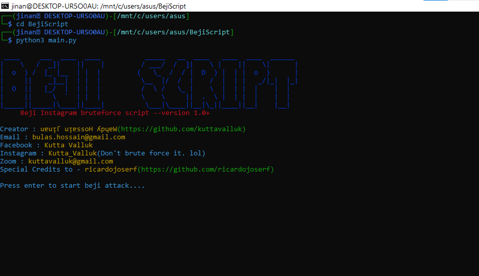

# BejiScript

<p align="center">
  
</p>

### Features

- Beginers freindly
- Not very fast but can perform a dictionary attack without problems.

### Installation

- Install Python and Git :
- (For debian based OS, for termux run command without sudo and replace apt with pkg. For windows users you can get python from microsoft store) 
```
$ sudo apt install python3 -y && sudo apt install git -y
```
- Install the Instapy Python module :
```
$ pip3 install instapy
```
- Just Clone this git repository :
```
$ git clone https://github.com/kuttavalluk/BejiScript
```

- Change current directory to BejiScript :
```
$ cd BejiScript
```
-  Write the target insta account in the userlist.txt file (default wordlist pw.txt)
-  Run the script (for termux use python instead of python3) :
```
$ python3 main.py
```
It is very easy to use and you'll probably have no problem using the script !

### Dependencies

**`BejiScript`** requires following programs to run properly - 
- `Python 3.x`
- `git`
- `Instapy`

> Supported Platform : **`Windows`**, **`Ubuntu/Debian/Kali`**, **`Termux`**, **`OSX/MacOS`**

## Acknowledgement :
- I used some code from a repository created by : [**ricardojoserf**](https://github.com/ricardojoserf)

## Note
- Tested in latest version of Kali, Ubuntu and Windows (Works with Python 3.x only ,no version of Python 2 is supported.)
- Works fine with WSL on Windows.
- Docker Support will be added later.
